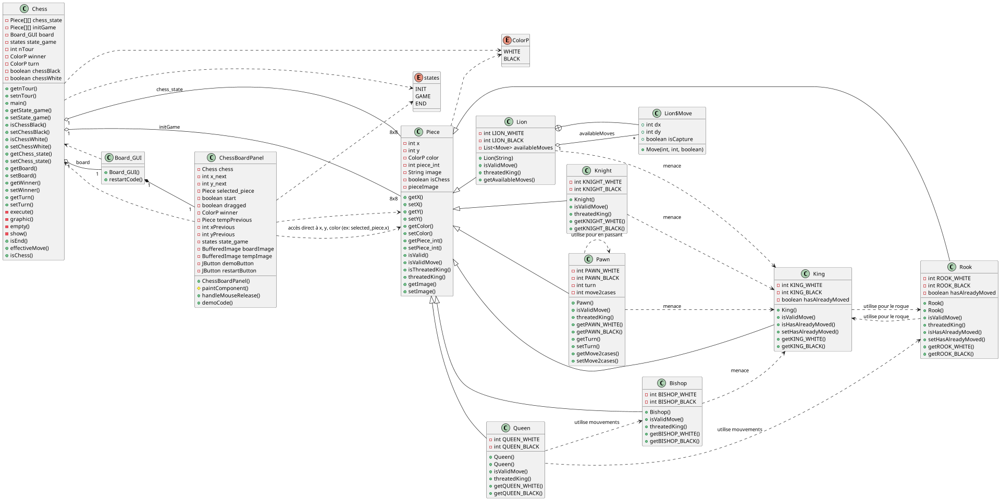

# Chess_CARTIER_P27APP_Partie_1

A comprehensive Java-based chess game developed as part of the P27APP project. This implementation follows object-oriented principles with a graphical user interface and supports all standard chess rules.

## Features

- Complete chess ruleset implementation
  - Standard piece movements
  - Special moves (castling, en passant, pawn promotion)
  - Check and checkmate detection
- Graphical user interface with drag-and-drop functionality
- Demo mode to showcase chess moves
- Game state management (init, active game, end game)
- Object-oriented design with inheritance hierarchy


- **Custom piece support through JSON configuration**
  - Dynamic loading of custom chess pieces
  - Configurable movement patterns
  - Path validation to prevent illegal moves

## UML Class Diagram

The following UML diagram illustrates the architecture of the application:



## Custom Pieces

The game supports custom chess pieces defined via JSON configuration files:

### Lion Piece

A powerful custom piece that combines attributes of multiple traditional pieces:
- Can move 2 squares in any direction (horizontal, vertical, or diagonal)
- Can capture pieces only on adjacent squares (like a king)
- Cannot jump over other pieces (the path must be clear)

Example JSON configuration for the Lion:

```json
{
  "pieceName": "Lion",
  "x": 2,
  "y": 0,
  "color": "BLACK",
  "availableMoves": [
    // Long-range movements (2 squares, no capture)
    { "dx": 0, "dy": 2, "isCapture": false, "isJump": false },
    { "dx": 2, "dy": 0, "isCapture": false, "isJump": false },
    // Adjacent captures (1 square, with capture)
    { "dx": 0, "dy": 1, "isCapture": true, "isJump": false },
    { "dx": 1, "dy": 0, "isCapture": true, "isJump": false }
    // Additional movements defined in full JSON...
  ]
}
```

## Requirements

- Java 8 or higher
- Eclipse IDE (recommended)
- Graphical display support

## Setup

### Development Setup (with VS Code)

1. Clone the repository to your local machine.
2. Open the project folder in Visual Studio Code (VS Code).
3. Ensure the Java Extension Pack is installed in VS Code.
4. Confirm the `assets` folder with chess piece images is present in the project directory.
5. Create a `piecesJSON` folder in the project root and add your custom piece JSON files.
6. Build and run the application using the VS Code Run/Debug features or the integrated terminal:
    ```sh
    cd /path/to/project
    javac -d bin src/in360/*.java src/in360/pieces/*.java
    java -cp bin in360.Chess
    ```

### Running Compiled Files Directly

1. Download or clone the repository and ensure the `assets` folder is included.
2. Create a `piecesJSON` folder and place your custom piece definitions there.
3. Open a terminal and navigate to the project directory.
4. Compile the Java source files (if not already compiled):
    ```sh
    javac -d bin src/in360/*.java src/in360/pieces/*.java
    ```
5. Run the application:
    ```sh
    java -cp bin in360.Chess
    ```

## Usage

1. Run the `Chess` class in the `in360` package to start the game
2. White player moves first
3. Drag and drop pieces to make moves
4. The game automatically enforces valid moves and detects check/checkmate
5. Custom pieces like the Lion follow their defined movement patterns from JSON

## Project Structure

- in360 - Main package
  - `Chess.java` - Game controller and state management
  - `Piece.java` - Abstract base class for all chess pieces
  - `Board_GUI.java` - Graphical interface implementation
  - `pieces/` - Package containing individual chess piece implementations
    - `King.java`, `Queen.java`, `Rook.java`, `Bishop.java`, `Knight.java`, `Pawn.java`
    - **`Lion.java`** - Custom piece with JSON-defined movement patterns
- assets - Image files for chess pieces
- **piecesJSON** - JSON configuration files for custom pieces
  - **`lion.json`** - Movement definition for the Lion piece
- uml.puml - UML class diagram in PlantUML format
- uml.png - Rendered UML diagram
- README.md - Project documentation

## Class Hierarchy

- `Piece` (Abstract class)
  - `King` - Implements one-square movement and castling
  - `Queen` - Implements diagonal and straight-line movement
  - `Rook` - Implements horizontal and vertical movement
  - `Bishop` - Implements diagonal movement
  - `Knight` - Implements L-shaped movement
  - `Pawn` - Implements pawn-specific rules like en passant and promotion
  - **`Lion`** - Custom piece with movements defined in JSON

## Implementation Details

- Each piece type provides its own `isValidMove()` method
- Chess rules verification occurs before allowing moves
- `threatedKing()` methods check for threats to kings
- The UI is built with Java Swing components
- **JSON parsing** is handled with Google's Gson library
- **Path validation** ensures pieces can't jump over others unless explicitly allowed

## Future Enhancements

- Game history and notation
- Save/load functionality
- AI opponent option
- Network multiplayer support
- Time controls
- **Custom piece editor** with visual interface
- **JSON schema validation** for custom piece definitions
- **Multiple custom pieces** in the same game

## Author

David CARTIER